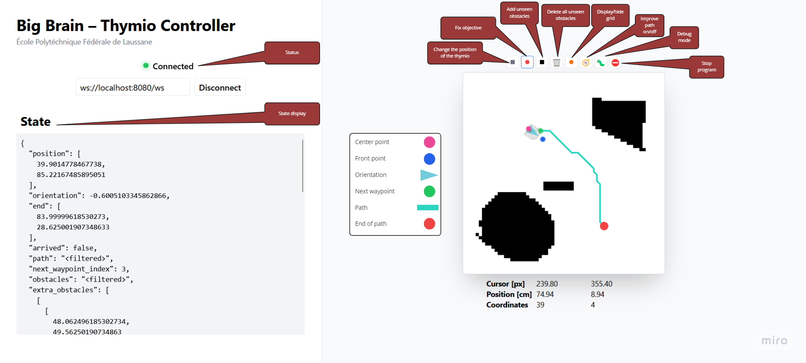

# Thymio Robotics Project

_A course project for MICRO-452 as part of MA-RO1 at EPFL, December 2022._

Designed to run on the Thymio robot. Written in Python, navigates the robot
through a dynamic obstacle scene.

### Features

- 📷 Realtime image processing for object detection using OpenCV
- 🤖 A Big Brain to make complex decision
- 🗺️ Optimal pathfinding using Dijkstra's algorithm
- 🚗 PID based motion control
- 📱 Realtime WebSocket based control server & Web UI
- 🧵 Asynchronous event loop
- 🚨 Cool lights
- 🔊 Cool sounds

## Prerequisites

In order to run the project, you wil need:

- A Thymio robot (or the simulator)
- A USB camera
- Python 3.10 or higher

Optionally, to use the real-time visualisation tool, you will also need a
modern version of Node.js® (>=16).

### Creating a virtual environment

It's recommended to create a "venv" to isolate the Python runtime and dependencies
from your system's global installation for more reliable results.

```powershell
$ python -m venv venv
```

To activate the virtual environment, run the script corresponding to your terminal
(such as `.ps1` for PowerShell):

```powershell
$ .\venv\scripts\Activate.ps1
```

This can be deactivated by simply running:

```powershell
$ deactivate
```

### Installing dependencies

While the virtual environment is activated, run the following command to install
all the required dependencies:

```powershell
$ pip install -r requirements.txt
```

### Setting up the visualisation tool

The visualisation tool (referred to here as the Web UI) is a Node.js application that
can be used to display the robot's camera feed. detected objects and a map with
path-finding information in real-time. For best results, it is recommended to
build the application prior to running it.

```powershell
$ cd ui
$ npm install
$ npm run build
```

If there are any issues, try installing dependencies using the pinned versions
from the lock file.

```powershell
$ npm ci
```

<div align="center" style="padding: 0rem 2rem;">
  <br />
  
  <br />
  <em>Figure: Screenshot of the web interface</em>
</div>
<br />

## Usage

The application should be run from the root directory of the project.

```powershell
$ python -m app
```

This will attempt to connect to the Thymio driver, lock a Thymio node and
start the main event loop. The control server is run on port `8080`.

First enter whether you would like to connect to a second Thymio node (Y/n),
then select the corners of the map and the two landmarks in the GUI window that
appears (instructions will also be printed in the terminal).

Using the Web UI, you can select a destination point and the robot will navigate
autonomously to that point, avoiding expected or unexpected obstacles.

To exit the application, press `Ctrl+C` in the terminal or use the stop button
in the Web UI.

### Starting the visualisation tool

In a separate terminal, `cd` back into the `ui` directory and run the following:

```powershell
$ cd ui
$ npm run preview
```

This will start a local web server on port `4173`. You can then open the
application in your browser by navigating to
[http://localhost:4173](http://localhost:4173).

The connection configuration should bet set to `localhost:8080` by default. This
assumes that the control server is running locally.

The control server supports any number of clients, so you can open the Web UI
in multiple tabs or windows to see the same information. Each client receives
an initial snapshot of the application `State` object, and then receives
incremental updates (or patches) as the state changes.

### Starting the notebook

The notebook report is used to explain the project and present the results.
It can be run using `jupyter-lab`.

```powershell
$ pip install jupyterlab
$ jupyter-lab
```

### Configuration

All application configuration is stored in the `config.py` file. To use
a simulated image, for example, set `USE_LIVE_CAMERA` to `False`.

## Authors

- Marcus Cemes
- Pablo Palle
- Adrien Pannatier
- Carolina Rodrigues Fidalgo

## License

This project is released under the MIT license.

See [LICENSE](LICENSE).
